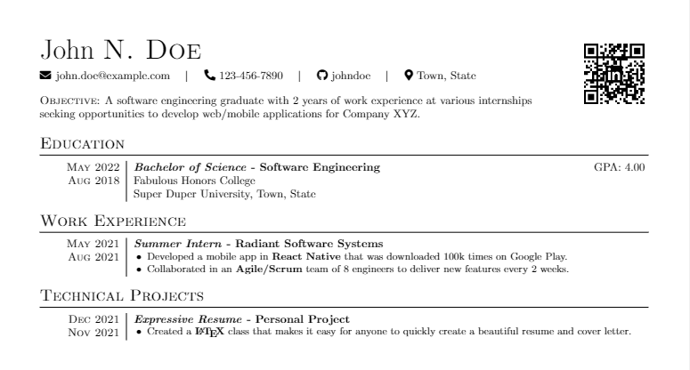
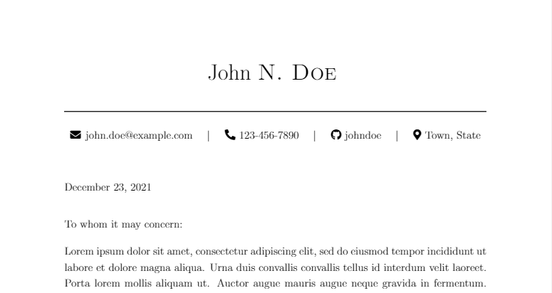

# Expressive Resume

A beautiful resume/cover letter LaTeX template pair that are extraordinarily easy to use.

**Why Expressive Resume??**

Most LaTeX resume/cover letter templates start with 100-200 lines of
formatting code (or more) that you have to scroll through before you
can focus on writing the _contents_ of your resume/cover letter.

With Expressive Resume, you simply specify the `documentclass` and
begin writing! There are also several custom functions that further
simplify your resume/cover letter's `.tex` code into clean expressions
of your accomplishments that are easy to update over time.

Additionally, ExpressiveResume is written in LaTeX2e, so it is
compatible with most LaTeX typesetting engines.

## Quickstart

### Create Your Expressive Resume

Clone this repository, then create an empty `.tex` file in the `src`
folder alongside the `.cls` files.

Use a `documentclass` of `ExpressiveResume`
```tex
\documentclass{ExpressiveResume}

\begin{document}

% The contents of your resume will go here.

\end{document}
```

Create your resume header with the `resumeheader` command (all
parameters are optional).

```tex
\resumeheader[
    firstname=,             % Your first name
    middleinitial=,         % Your middle initial
    lastname=,              % Your last name
    email=,                 % Your email
    phone=,                 % Your phone number, formatted as XXX-XXX-XXXX
    github=,                % Your GitHub handle (without the @)
    city=,                  % Your city of residence (ignored if no `state` is given)
    state=,                 % Your state of residence
    qrcode=,                % the path to a qr code to show in the top right corner
    fixobjectivespacing=    % Recommended when using both a qrcode and an `objective`
]
```

If you want a summary/objective statement in your resume, that's easy
to add.

```tex
\objective{
    % Your objective statement here.
}
```

Adding experiences and achievements is also straightforward.
```tex
\experience{Position}{Company}{Start Date}{End Date}{
    \achievement{
        % Describe your achievement here
    }
    \achievement{
        % Describe another achievement here.
    }
}
```

You can also easily add inline highlights for the technologies and
skills relevant to the job position you are applying for.

```tex
\tech{
    % Name your familiar technology or skill
}
```

And that's it! Take a look at the [resume
example](#example-expressive-resume) to see just how cleanly all
of these pieces work together in a simple, readable `.tex` file to
produce a beautiful resume.

### Create Your Expressive Cover Letter

Clone this repository, then create an empty `.tex` file in the `src`
folder alongside the `.cls` files.

Use a `documentclass` of `ExpressiveCoverLetter`
```tex
\documentclass{ExpressiveCoverLetter}

\begin{document}

% The contents of your cover letter will go here.

\end{document}
```

Create your cover letter header with the `coverletterheader` command
(all parameters are optional).

```tex
\coverletterheader[
    firstname=,             % Your first name
    middleinitial=,         % Your middle initial
    lastname=,              % Your last name
    email=,                 % Your email
    phone=,                 % Your phone number, formatted as XXX-XXX-XXXX
    github=,                % Your GitHub handle (without the @)
    city=,                  % Your city of residence (ignored if no `state` is given)
    state=,                 % Your state of residence
]
```

From there, just write out the text of your cover letter, using a blank
line between paragraphs.

You can also easily add inline highlights for the technologies and
skills relevant to the job position you are applying for.

```tex
\tech{
    % Name your familiar technology or skill
}
```

And that's it! Take a look at the [cover letter
example](#example-expressive-cover-letter) to see just how cleanly all
of these pieces work together in a simple, readable `.tex` file to
produce a beautiful cover letter.

## Examples
### Example Expressive Resume
 

```tex
\documentclass{ExpressiveResume}

% ----- Resume -----
\begin{document}

% ----- Name + Contact Information -----
\resumeheader[
    firstname=John,
    middleinitial=N,
    lastname=Doe,
    email=john.doe@example.com,
    phone=123-456-7890,
    github=johndoe,
    city=Town,
    state=State,
    qrcode=./images/qr.png,
    fixobjectivespacing=true
]

\objective{A software engineering graduate with 2 years of work
experience at various internships \\ seeking opportunities to develop
web/mobile applications for Company XYZ.}

% ----- Education -----
\section{Education}
\experience{Bachelor of Science}{Software Engineering}{Aug 2018}{May 2022}{
    \hfill GPA: 4.00 \newline
    Fabulous Honors College \newline
    Super Duper University, Town, State \newline
}

% ----- Work Experience -----
\section{Work Experience}
\experience{Summer Intern}{Radiant Software Systems}{Aug 2021}{May 2021}{
    \achievement{   
        Developed a mobile app in \tech{React Native} that was
        downloaded 100k times on Google Play.
    }
    \achievement{
        Collaborated in an \tech{Agile/Scrum} team of 8 engineers to
        deliver new features every 2 weeks.
    }
}

% ----- Technical Projects -----
\section{Technical Projects}
\experience{Expressive Resume}{Personal Project}{Nov 2021}{Dec 2021}{
    \achievement{
        Created a \tech{\LaTeX} class that makes it easy for anyone to
        quickly create a beautiful resume and cover letter.
    }
}

\end{document}
```

### Example Expressive Cover Letter


```tex
\documentclass{ExpressiveCoverLetter}

\begin{document}

\coverletterheader[
    firstname=John,
    middleinitial=N,
    lastname=Doe,
    email=john.doe@example.com,
    phone=123-456-7890,
    github=johndoe,
    city=Town,
    state=State
]

\vspace{0.25in}
\today
\vspace{0.15in}


To whom it may concern:

Lorem ipsum dolor sit amet ...

Sincerely,

\vspace{.15in}

John Doe

\end{document}
```
